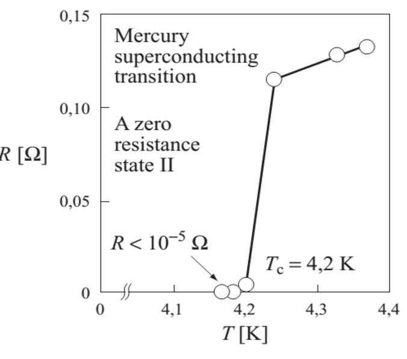

# Superconductivity:
- We know that when temperature of a conductor is decreased, then it's resistence decreases linearly

  - According to the relation:
 
$$R=R_o(1+\alpha{t}) \longrightarrow (1)$$

where:

 $$R_o=resistence\text{ } at\text{ } 0 \degree C$$

 $$R= resistence\text{ } at\text{ } t \degree C$$

 $$\alpha = temperature\text{ } coefficient\text{ } of\text{ } resistence$$

This is positive(+ve) for metals.\
That if temeperature is increased then resistence of conductor will also increase and vice versa.\
If the temperature is expressed in absolute units(K) then above equation becomes a straight line passing through origin like

$$R=R_o\gamma T\longrightarrow (2)$$

Accordingly resistence of a conductor will become zero only at absolute zero (that is 0 kelvin).\
This property was being verified by scientist 'Kamerlingh Onnes' for mercury (Hg).\
He was decreasing temperature of Hg and observing it's resistence.\
Then he plotted graph between resistence of Hg and absolute temperature.\
As expected, the graph was linear and it's extra polation was hinting that graph will pass through origin.\
However, suprisingly at temperature 4.18K $$(\approx{4.2K})$$, the resistence of Hg suddenly became zero as shown in fig.1.

He called this phenomenon as "superconductivity".
- **Defination**: The loss of resistance by certain materials when cooled superconductivity and materials showing this property are called _superconductors_.

