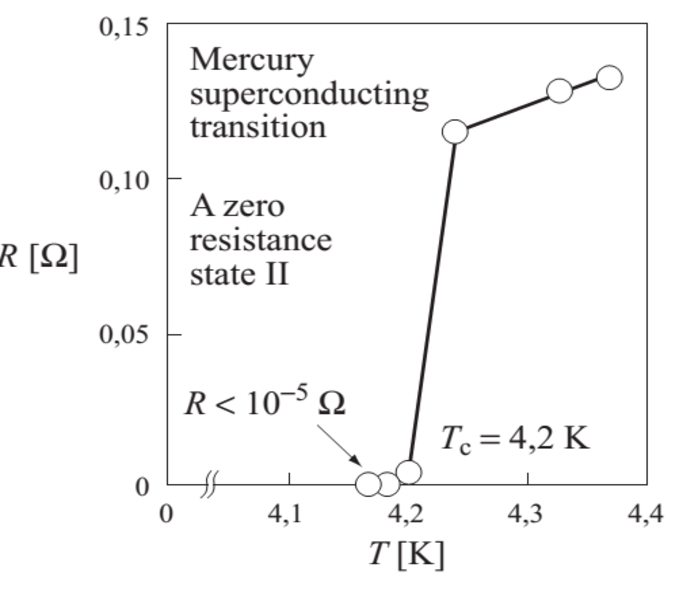

# Superconductivity:
- We know that when temperature of a conductor is decreased, then it's resistence decreases linearly

  - According to the relation:
 
$$R=R_o(1+\alpha{t}) \longrightarrow (1)$$

where:

 $$R_o=resistence\text{ } at\text{ } 0 \degree C$$

 $$R= resistence\text{ } at\text{ } t \degree C$$

 $$\alpha = temperature\text{ } coefficient\text{ } of\text{ } resistence$$

This is positive(+ve) for metals.\
That if temeperature is increased then resistence of conductor will also increase and vice versa.\
If the temperature is expressed in absolute units(K) then above equation becomes a straight line passing through origin like

$$R=R_o\gamma T\longrightarrow (2)$$

Accordingly resistence of a conductor will become zero only at absolute zero (that is 0 kelvin).\
This property was being verified by scientist 'Kamerlingh Onnes' for mercury (Hg).\
He was decreasing temperature of Hg and observing it's resistence.\
Then he plotted graph between resistence of Hg and absolute temperature.\
As expected, the graph was linear and it's extra polation was hinting that graph will pass through origin.\
However, suprisingly at temperature 4.18K $$(\approx{4.2K})$$, the resistence of Hg suddenly became zero as shown in fig.1.

He called this phenomenon as "superconductivity".
- **Defination**: The loss of resistance by certain materials when cooled superconductivity and materials showing this property are called _superconductors_.

Creating a platform like **Codetantra** from scratch involves multiple steps, from designing the user interface to developing backend systems, integrating features for learning, assessment, and evaluation, and ensuring scalability and security. Below is a detailed step-by-step map for building a platform like Codetantra:

### 1. **Requirement Analysis & Planning**
   - **Target Audience**: Define your target audience. Are you targeting educational institutions, individuals, or corporate training programs?
   - **Features & Functionalities**: Outline the features you want to include. These could include:
     - Interactive coding environments.
     - Coding challenges and assessments.
     - Learning management systems (LMS).
     - User profiles (students, instructors).
     - Progress tracking and analytics.
     - Real-time code execution and error checking.
     - Gamification and leaderboards.

### 2. **Designing the User Experience (UX) & User Interface (UI)**
   - **Wireframes**: Create wireframes for the platform. Sketch the main components like:
     - Dashboard.
     - Course sections and modules.
     - Assignment/Challenge submissions.
     - Results and performance tracking.
     - Interactive coding editor.
   - **UI Design**: Design the final look and feel of the platform. Focus on:
     - User-friendly interface.
     - Intuitive navigation.
     - Clear visual hierarchy (coding editor, menus, etc.).
     - Mobile responsiveness.
   - **Prototyping**: Use tools like Figma or Adobe XD to create interactive prototypes for testing and feedback.

### 3. **Choosing Tech Stack**
   The technology stack plays a crucial role in the performance and scalability of the platform.
   - **Frontend (UI)**:
     - **HTML5, CSS3, JavaScript** (Core technologies).
     - Frameworks: React.js, Angular, or Vue.js for building dynamic user interfaces.
     - Code Editor: Implementing an in-browser code editor like **Monaco Editor** (used in Visual Studio Code) or **CodeMirror**.
   - **Backend (Server-side)**:
     - **Node.js with Express.js**, Django (Python), or Ruby on Rails for building APIs and handling server-side logic.
     - **Real-time collaboration**: Use **WebSockets** for real-time coding and chat interaction.
   - **Database**:
     - **SQL (PostgreSQL/MySQL)** or **NoSQL (MongoDB)** for user data, assignments, courses, etc.
     - You may also need a file storage system for uploading assignments, course materials, etc. (e.g., Amazon S3 or similar cloud storage solutions).
   - **Code Execution**:
     - Set up a secure environment (containerized services, Docker, or Kubernetes) to run code written by users. Platforms like **Judge0** or **Sphere Engine** can handle code execution safely in multiple languages.
   - **Authentication & Security**:
     - **JWT (JSON Web Tokens)** for secure authentication and authorization.
     - **OAuth2** for third-party logins (e.g., Google, Facebook).
     - Implement HTTPS, encryption, and secure data storage for user privacy.

### 4. **Development Process**
   **Step-by-step implementation:**
   - **Frontend Development**:
     - Develop user-facing features: Registration, login, dashboard, etc.
     - Code editor interface: Allow users to write, compile, and execute code within the platform.
     - Course modules: Provide course content and modules for structured learning.
     - Assignments & Challenges: Implement a way to upload, evaluate, and provide feedback on assignments.
   - **Backend Development**:
     - **APIs**: Develop APIs for user registration, course management, submission handling, etc.
     - **Admin Panel**: Build an admin interface for instructors to create courses, manage assessments, and track student progress.
     - **Real-time Collaboration**: Implement live coding and real-time feedback systems.
   - **Code Execution System**:
     - Create a system for compiling and running code securely. For this, you could use technologies like Docker to create isolated containers for code execution.
     - Ensure support for multiple programming languages (e.g., Python, Java, C++, JavaScript, etc.).
     - Implement error handling, time limits, and resource usage limits to prevent abuse.

### 5. **Testing**
   - **Unit Testing**: Write unit tests for the backend API and the front-end components to ensure they function as expected.
   - **Integration Testing**: Test the entire flow, from course creation to code submission and result generation.
   - **Load Testing**: Simulate user traffic to check how the platform handles large volumes of users and interactions.
   - **Security Testing**: Ensure there are no vulnerabilities, such as SQL injection, XSS, or CSRF attacks.

### 6. **Deployment & Hosting**
   - **Cloud Hosting**: Choose a cloud service like **AWS**, **Google Cloud**, or **Azure** for hosting your platform.
     - **Frontend**: Host the static assets (HTML, CSS, JS) using services like AWS S3, Netlify, or Vercel.
     - **Backend**: Use services like AWS EC2, Heroku, or DigitalOcean to deploy the backend.
   - **Code Execution Servers**: Use cloud services or dedicated servers for running code in multiple languages. Docker containers or Kubernetes can help manage scalable code execution instances.
   - **CI/CD**: Set up Continuous Integration/Continuous Deployment (CI/CD) pipelines using **GitLab CI**, **GitHub Actions**, or **Jenkins** to streamline updates and releases.

### 7. **Monitoring & Analytics**
   - **Monitoring**: Use services like **Datadog**, **New Relic**, or **Prometheus** to monitor the health of your platform.
   - **User Analytics**: Implement analytics tools like **Google Analytics**, **Mixpanel**, or **Segment** to track user activity, behavior, and engagement.
   - **Error Reporting**: Use services like **Sentry** to capture and resolve errors in real-time.

### 8. **User Support & Documentation**
   - **Help Center**: Create a knowledge base with tutorials, FAQs, and troubleshooting guides.
   - **Live Support**: Implement a chat support feature for real-time customer assistance.
   - **Community Forum**: Allow users to ask questions and share knowledge through discussion forums or Slack/Discord channels.

### 9. **Marketing & Scaling**
   - **Marketing**: Create a marketing plan that includes SEO, paid ads, social media campaigns, and partnerships with educational institutions or corporate training centers.
   - **Scaling**: Plan for scaling your infrastructure to handle increasing traffic. Use cloud services with auto-scaling and load balancing.

### 10. **Continuous Improvement & Updates**
   - Regularly update the platform with new features, coding languages, challenges, and improvements.
   - Gather user feedback and refine the platform to meet their evolving needs.
   - Keep an eye on emerging technologies like AI-based code suggestion or personalized learning paths.

---

### Potential Challenges
- **Security**: Code execution environments can be vulnerable if not properly sandboxed. Ensure that each user’s code is executed in a secure and isolated environment.
- **Scalability**: Handling a large number of concurrent users can require significant infrastructure. This is where cloud services can help.
- **Accuracy of Assessments**: Creating a system that evaluates code accurately and fairly, particularly for edge cases, can be complex.
- **User Experience**: Balancing simplicity and feature-richness in the UI/UX can be a challenge.

Building a platform like Codetantra is complex but achievable with the right team and technology stack. If you need more specific guidance on any step, feel free to ask!
